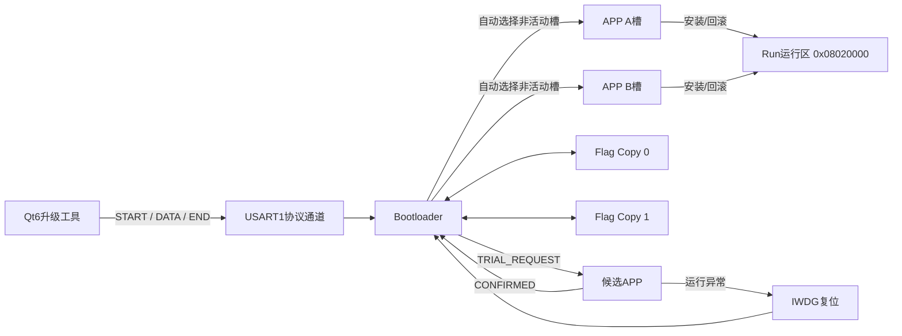
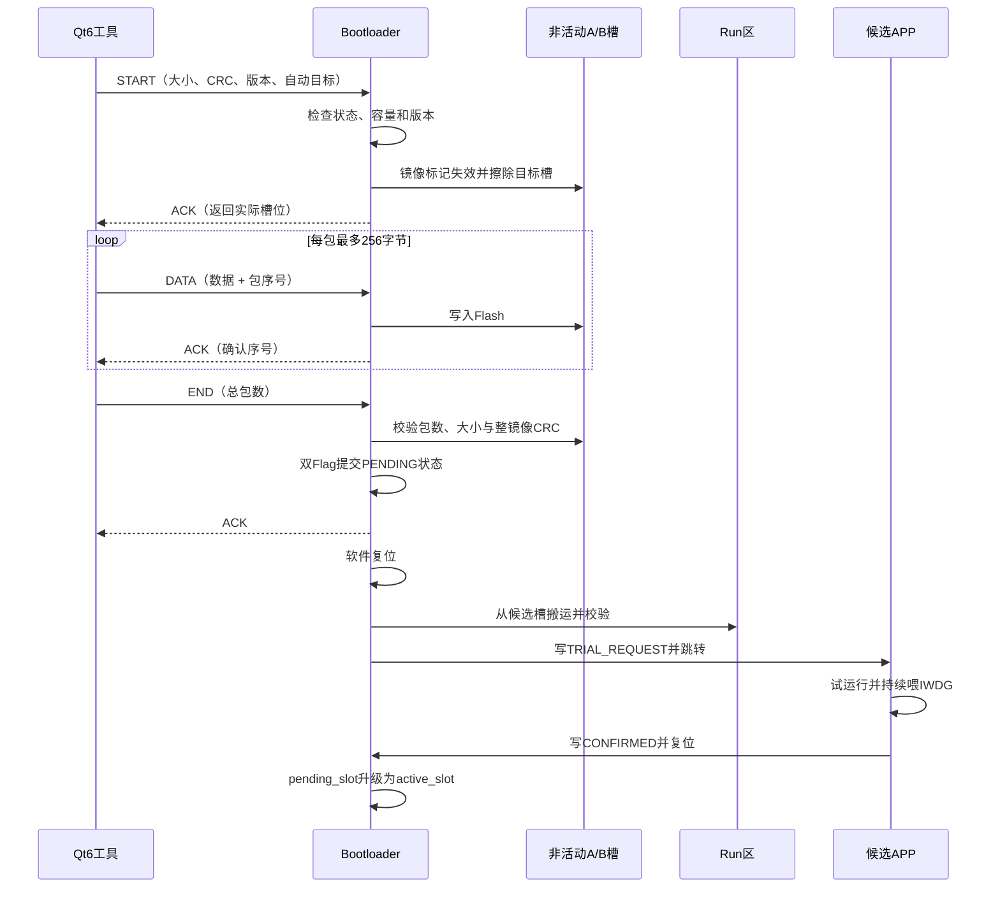
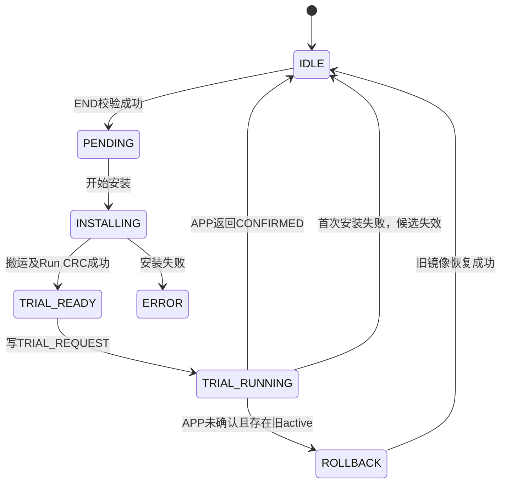

# STM32F407 可靠固件升级系统

> Bootloader + A/B Slot + Run运行区 + Trial/Confirm + 自动Rollback + Qt6升级工具

---

## 项目简介

本项目是一套基于 **STM32F407ZGT6** 的串口 IAP 固件升级系统。

针对传统固件升级过程中可能出现的：

- 升级掉电导致程序损坏
- 固件传输错误
- APP启动失败
- 新版本运行异常无法恢复

等问题，设计了一套可靠升级机制。

系统由三部分组成：

- STM32 Bootloader
- A/B 固件备份槽
- Qt6 PC升级工具


核心设计：

> A/B槽用于保存固件镜像，Run区域作为唯一执行区域。Bootloader负责镜像管理、校验、安装和回滚。


---

# 核心特点

## 1. A/B Slot + Run运行区

- A/B槽保存候选固件和旧版本固件
- APP不直接在备份槽运行
- Bootloader负责搬运镜像到固定Run区域执行
- A/B两个APP采用相同链接地址


## 2. 双Flag事务存储

- 两份Flag副本轮换保存
- Sequence递增选择最新状态
- CRC校验保证Flag有效性
- 支持掉电恢复


## 3. UART可靠升级协议

支持：

- START / DATA / END命令
- CRC16帧校验
- ACK/NACK应答
- 包序号检测
- 超时重发
- 重复数据包处理


## 4. Trial / Confirm机制

新固件升级后不会立即成为正式版本：

```

安装新版本

↓

Trial试运行

↓

APP确认

↓

正式提交

```

如果APP启动异常，则自动回滚。


## 5. IWDG异常检测

APP运行期间开启独立看门狗：

```

APP异常

↓

IWDG Reset

↓

Bootloader检测

↓

Rollback恢复旧版本

````


## 6. Qt6升级工具

实现完整升级闭环：

- BIN选择
- CRC计算
- 版本输入
- 协议组帧
- 固件分包发送
- ACK处理
- 重传
- 升级进度显示


---

# 系统架构

```mermaid
flowchart LR

PC["Qt6升级工具"]

PC -->|"START/DATA/END"| UART["USART1"]

UART --> BOOT["Bootloader"]


BOOT --> SLOT_A["APP Slot A"]

BOOT --> SLOT_B["APP Slot B"]


SLOT_A --> RUN["Run运行区"]

SLOT_B --> RUN


BOOT <--> FLAG0["Flag Copy 0"]

BOOT <--> FLAG1["Flag Copy 1"]


BOOT -->|"TRIAL_REQUEST"| APP["APP"]

APP -->|"CONFIRMED"| BOOT

APP --> IWDG["IWDG Reset"]

IWDG --> BOOT

````

---

# Flash布局

芯片：

```
STM32F407ZGTx
Flash: 1MB
```

| 区域         | Sector | 地址                    | 大小    | 作用      |
| ---------- | ------ | --------------------- | ----- | ------- |
| Bootloader | 0~3    | 0x08000000-0x0800FFFF | 64KB  | 启动与升级控制 |
| Flag Copy0 | 4      | 0x08010000-0x0801FFFF | 64KB  | 状态副本    |
| Run APP    | 5~6    | 0x08020000-0x0805FFFF | 256KB | APP执行区域 |
| APP Slot A | 7~8    | 0x08060000-0x0809FFFF | 256KB | 固件备份    |
| APP Slot B | 9~10   | 0x080A0000-0x080DFFFF | 256KB | 固件备份    |
| Flag Copy1 | 11     | 0x080E0000-0x080FFFFF | 128KB | 状态副本    |

APP链接：

```
APP Address:
0x08020000

VTOR Offset:
0x00020000
```

设计原因：

采用独立Run区域，使A/B镜像保持统一链接地址，降低双镜像启动管理复杂度。

---

# 升级流程

## 正常升级

```
Qt发送固件

↓

START

↓

版本检查

↓

选择非活动Slot

↓

DATA分包写入

↓

END校验CRC

↓

Flag提交PENDING

↓

Boot复位

↓

安装到Run区域

↓

Trial运行

↓

APP Confirm

↓

版本提交
```

## 失败恢复

```
APP启动失败

↓

未收到Confirm

↓

IWDG Reset

↓

Bootloader检测

↓

Rollback

↓

恢复旧版本
```

---

# 状态机

升级状态通过Flag保存：

| 状态            | 说明          |
| ------------- | ----------- |
| IDLE          | 正常运行        |
| PENDING       | 固件接收完成，等待安装 |
| INSTALLING    | 正在搬运镜像      |
| TRIAL_READY   | 等待试运行       |
| TRIAL_RUNNING | 等待APP确认     |
| ROLLBACK      | 执行回滚        |
| ERROR         | 异常状态        |

状态流转：

```
IDLE

↓

PENDING

↓

INSTALLING

↓

TRIAL_READY

↓

TRIAL_RUNNING

↓

CONFIRMED

↓

IDLE


失败：

TRIAL_RUNNING

↓

ROLLBACK

↓

IDLE
```

---

# UART升级协议

通信参数：

```
115200
8N1
无流控
```

协议格式：

```
SOF(2B)

+

CMD(2B)

+

LEN(2B)

+

DATA(NB)

+

RESERVE(4B)

+

CRC16(2B)
```

支持命令：

| 命令           | 作用     |
| ------------ | ------ |
| START_UPDATE | 开始升级   |
| DATA_PACKET  | 发送固件数据 |
| END_UPDATE   | 结束升级   |
| ACK          | 成功响应   |
| NACK         | 错误响应   |

可靠机制：

* 分包传输
* ACK确认
* 超时重发
* 重复包检测

---

# 双Flag可靠存储

Flag保存：

* Magic
* 结构版本
* Sequence
* Slot信息
* 固件大小
* CRC
* 版本号
* 当前状态

更新流程：

```
生成新Flag

↓

Sequence++

↓

擦除备用Flag

↓

写入

↓

回读校验

↓

提交成功
```

启动时：

```
读取Flag0

读取Flag1

↓

CRC检查

↓

选择最新有效版本
```

---

# 镜像完整性校验

升级过程中：

1. DATA阶段写入备份槽
2. END阶段检查：

   * 数据大小
   * 包数量
   * CRC16
3. 安装到Run区后再次CRC校验
4. APP启动前检查：

   * 栈地址
   * Reset向量
   * 镜像CRC

---

# Trial / Confirm机制

为什么需要Trial？

CRC只能证明：

> 固件数据正确

不能证明：

> APP能够正常运行

流程：

```
Bootloader安装新版本

↓

写TRIAL_REQUEST

↓

启动APP

↓

APP运行检测

↓

写CONFIRMED

↓

复位

↓

正式提交
```

确认存储：

```
RTC Backup Register
```

---

# 版本管理

版本采用32位整数保存：

```
V3.1.2.6

↓

0x03010206
```

格式：

```
31~24 Major

23~16 Minor

15~8  Patch

7~0   Build
```

升级策略：

| 情况   | 处理   |
| ---- | ---- |
| 首次安装 | 允许   |
| 高版本  | 允许升级 |
| 同版本  | 允许重装 |
| 低版本  | 拒绝   |

版本比较基于：

```
active_slot
```

而不是未确认的新版本。

---

# Qt6升级工具

基于：

* Qt6 Widgets
* Qt SerialPort
* CMake

功能：

* 串口扫描
* BIN读取
* CRC计算
* 版本输入
* 自动分包
* ACK解析
* 超时重发
* 日志显示

特点：

Qt不维护A/B布局。

只发送：

```
升级这个固件
```

目标Slot由Bootloader自动选择。

---

# 测试验证

已完成：

| 测试          | 结果 |
| ----------- | -- |
| 正常A/B升级     | 通过 |
| UART分包接收    | 通过 |
| ACK丢失重传     | 通过 |
| CRC错误检测     | 通过 |
| Flash写入掉电恢复 | 通过 |
| Flag更新掉电恢复  | 通过 |
| 安装阶段掉电恢复    | 通过 |
| Trial失败回滚   | 通过 |
| IWDG异常复位恢复  | 通过 |
| 首次安装失败处理    | 通过 |
| 版本降级拒绝      | 通过 |
| 版本回滚一致性     | 通过 |

---

# 设计取舍

## 为什么采用A/B Slot + Run？

相比双APP直接运行：

优点：

* APP统一链接地址
* 向量表固定
* Bootloader逻辑简单

代价：

* 切换版本需要Flash搬运

---

## 为什么使用双Flag？

单Flag：

```
擦除

↓

写入

↓

掉电
```

可能导致状态丢失。

双Flag：

```
旧状态

+

新状态

```

保证至少存在一个有效记录。

---

## 为什么CRC不能保证安全？

CRC只能检测：

* 数据错误
* Flash损坏

不能验证：

* 固件来源
* 固件是否被篡改

如果产品化，需要增加：

* 数字签名
* 加密验证

---

# 后续扩展

APP层可进一步增加：

* WiFi通信
* Ethernet通信
* 远程升级触发
```
## 项目简介

本项目是一套基于 STM32F407 的串口 IAP 固件升级系统，由 STM32 Bootloader、A/B 示例 APP 和 Qt6 上位机三部分组成。

系统采用 **A/B 固件备份槽 + 独立 Run 运行区**：上位机将新固件下载到非活动槽，Bootloader校验后再搬运到固定运行地址。新APP不会立即成为正式版本，而是先进入试运行；APP确认运行正常后才完成版本切换，未确认或看门狗复位则恢复旧固件。

### 核心特点

- **A/B Slot + Run运行区**：备份镜像与执行地址分离，升级目标由Bootloader自动选择；
- **双Flag事务存储**：双副本轮换提交，通过Sequence和CRC选择最新有效状态；
- **UART可靠升级协议**：支持流式拼帧、ACK/NACK、包序号、超时重发和重复包确认；
- **Trial/Confirm + IWDG**：新固件先试运行，APP确认成功后才正式切换；
- **自动Rollback**：试运行未确认或异常复位时，从旧活动槽恢复Run区；
- **Qt6升级工具**：完成固件选择、版本输入、协议传输、升级进度及日志展示。

仓库主要工程：

| 目录 | 内容 |
|---|---|
| `MDK-ARM/` | Bootloader Keil工程 |
| `Drivers/BSP/` | 协议、Flash、Flag、安装与回滚模块 |
| `A-APP-1/` | 示例APP A工程 |
| `B-APP-1/` | 示例APP B工程 |
| `PC_IAP/` | Qt6串口升级工具 |

## 系统架构



各部分职责如下：

- **A/B槽**：保存候选固件和可回滚的旧固件，不直接执行；
- **Run区**：固定APP执行地址，A/B两个APP工程均链接到 `0x08020000`；
- **Bootloader**：处理通信、镜像校验、Flag状态、安装、跳转和回滚；
- **双Flag**：持久化A/B镜像元数据及安装状态；
- **RTC Backup Register**：在Bootloader与APP之间传递试运行请求和确认结果；
- **Qt工具**：负责BIN读取、协议组帧、停等式发送、重传及进度展示。

当前架构不是直接在A/B槽执行的双运行区方案。这样可以让两个APP使用相同的链接地址和向量表配置，代价是升级和回滚时需要将固件搬运到Run区。

## Flash布局

目标器件为 STM32F407ZGTx，内部Flash容量为1 MiB。

独立Run区使A、B槽中的镜像采用同一套APP链接地址与向量表配置。Bootloader只需选择镜像来源并搬运到Run区，不需要分别构建可在A、B地址直接执行的固件。

| 区域 | Sector | 地址范围 | 容量 | 作用 |
|---|---:|---|---:|---|
| Bootloader | 0~3 | `0x08000000 - 0x0800FFFF` | 64 KiB | 启动与升级控制 |
| Flag Copy 0 | 4 | `0x08010000 - 0x0801FFFF` | 64 KiB | 第一份状态副本 |
| Run APP | 5~6 | `0x08020000 - 0x0805FFFF` | 256 KiB | APP实际运行区 |
| APP A | 7~8 | `0x08060000 - 0x0809FFFF` | 256 KiB | A固件备份槽 |
| APP B | 9~10 | `0x080A0000 - 0x080DFFFF` | 256 KiB | B固件备份槽 |
| Flag Copy 1 | 11 | `0x080E0000 - 0x080FFFFF` | 128 KiB | 第二份状态副本 |

Bootloader只允许擦写Flag、Run、A和B区域，不允许升级流程覆盖Bootloader自身。APP的链接地址和向量表偏移分别为：

```text
APP链接地址：0x08020000
VTOR偏移：   0x00020000
```

## 升级流程

升级分为“固件接收”和“安装试运行”两个阶段。



Bootloader上电后先处理未完成的安装、确认或回滚任务；状态稳定后等待升级命令3秒。若没有收到命令且Run区向量表及CRC有效，则清理中断和外设状态、设置VTOR与MSP并跳转APP。

## 状态机

Flag中的 `install_state` 定义了跨复位保存的安装状态：

| 状态 | 值 | 含义 | 复位后的处理 |
|---|---:|---|---|
| IDLE | 0 | 无待处理镜像 | 校验Run区并正常启动 |
| PENDING | 1 | 候选镜像已接收并通过CRC | 开始安装到Run区 |
| INSTALLING | 2 | 正在搬运候选镜像 | 重新执行完整搬运 |
| TRIAL_READY | 3 | Run区已更新，等待首次试运行 | 写试运行请求并跳转 |
| TRIAL_RUNNING | 4 | 候选APP正在等待确认 | 确认则转正，未确认则回滚 |
| ROLLBACK | 5 | 正在恢复旧活动镜像 | 重新执行回滚 |
| ERROR | 6 | 安装或校验失败 | 停留Bootloader等待处理 |



`PENDING`、`INSTALLING`和`ROLLBACK`都能够在复位后继续处理，避免把Run区的中间状态当成可启动镜像。

## 协议设计

UART使用115200、8N1、无流控。USART1承载二进制协议，USART2输出调试日志。当前接收方式为 `HAL_UARTEx_ReceiveToIdle_IT()`，没有使用DMA。

通用帧格式如下，所有多字节字段均为小端：

```text
SOF(2B) + CMD(2B) + TOTAL_LEN(2B) + DATA(NB) + RESERVE(4B) + CRC16(2B)
```

`SOF`固定为 `0xAA 0x55`。`TOTAL_LEN`包含SOF和CRC在内的整张协议帧；协议帧CRC16覆盖SOF、CMD、TOTAL_LEN、DATA和RESERVE，不包含末尾CRC字段本身。BIN固件整体CRC仍然只覆盖真实BIN内容，与协议帧CRC相互独立。

| 帧类型 | 总长度 |
|---|---:|
| START | 19字节 |
| DATA | 13~268字节 |
| END | 12字节 |
| ACK/NACK | 16字节 |

| 命令 | 值 | DATA | RESERVE |
|---|---:|---|---|
| START_UPDATE | `0x0002` | 自动目标、BIN大小、BIN CRC16 | 32位固件版本 |
| DATA_PACKET | `0x0003` | 1~256字节BIN数据 | 包序号 |
| END_UPDATE | `0x0004` | 无 | DATA总包数 |
| ACK | `0x8000` | 原始命令、结果码 | 已确认序号、槽位或包总数 |
| NACK | `0x8001` | 原始命令、错误码 | 期望序号或当前版本 |

协议接收器先在字节流中寻找 `0xAA 0x55`，收到前6字节后解析整帧长度，长度达到预期值后再交给主循环处理。因此一次UART回调可以只包含部分帧，帧头前的噪声或错位字节也能被丢弃；Flash擦除和写入不在UART回调中执行。

Qt采用停等方式：每发送一张START、DATA或END后等待对应ACK。ACK等待时间为3秒，最多重发3次。重发使用保存的完整原帧；Bootloader识别重复START、DATA和END并返回原应答，不重复擦除或累计写入。

协议通过NACK区分帧格式、状态、容量、包序号、Flash写入、总包数、镜像大小、镜像CRC、未知命令和版本错误。

## 可靠性设计

### 双Flag事务存储

Flag Copy 0和Copy 1均保存：

- Magic和Flag结构版本；
- 递增事务序号 `sequence`；
- A/B镜像有效标记、大小、CRC和版本；
- `active_slot`、`pending_slot`与安装状态；
- 整个Flag结构的CRC16。

更新Flag时不直接覆盖当前有效副本，而是在另一副本中提交：

1. 在RAM构造候选Flag并递增 `sequence`；
2. 擦除目标Flag扇区；
3. 写入完整结构；
4. 从Flash回读并检查Magic、结构版本、CRC和内容；
5. 成功后切换当前副本。

上电时同时校验两份Flag，选择有效且序号更新的副本。写入中断时仍可使用另一份已完成提交的状态。

### 镜像完整性

- START先使目标槽镜像标记失效，再擦除目标槽；
- Flash按32位对齐写入，尾包不足4字节时使用 `0xFF` 补齐；
- END按BIN真实长度检查总包数、接收大小和整镜像CRC16；
- 槽位搬运到Run区后再次计算CRC16；
- 启动APP前检查栈地址、复位向量范围和Run区CRC。

### 试运行与回滚

Bootloader通过RTC Backup Register写入 `TRIAL_REQUEST`。候选APP正常运行约3秒后写入 `CONFIRMED` 并复位，Bootloader才把候选槽升级为正式 `active_slot`。

APP启动IWDG，当前配置超时约5秒。若候选APP卡死或无法完成确认，IWDG触发复位；Bootloader检测到 `TRIAL_RUNNING`且没有确认标志后，从旧 `active_slot`重新构建Run区。若这是首次安装、没有旧活动镜像，则将失败候选标记无效并停留在Bootloader。

## 版本管理

固件版本以32位无符号整数保存于START帧和A/B镜像元数据中：

```text
[31:24] Major
[23:16] Minor
[15:8]  Patch
[7:0]   Build
```

例如 `V3.1.2.6` 编码为 `0x03010206`。版本信息与镜像大小、CRC一起进入双Flag事务，因此版本切换与槽位状态保持一致。

版本策略：

- 当前没有有效活动版本：允许首次安装；
- 请求版本高于当前版本：允许升级；
- 请求版本等于当前版本：允许重新安装；
- 请求版本低于当前版本：在擦除目标槽之前返回NACK；
- `0.0.0.0`保留为无版本信息，不允许作为正式升级版本。

版本比较以已通过试运行的 `active_slot`为基准，不以尚未确认的候选版本为基准。试运行失败并回滚后，活动版本仍保持为旧版本。

## Qt工具

`PC_IAP`基于 Qt6 Widgets、Qt SerialPort和CMake实现，主要功能包括：

- 枚举、打开和关闭串口；
- 读取BIN文件并计算CRC16；
- 输入并校验 `Major.Minor.Patch.Build`版本；
- 构造START、DATA、END帧；
- 按256字节自动分包；
- 搜索固定SOF并解析16字节ACK/NACK；
- ACK超时重发和重复应答处理；
- 显示发送包数、进度、最近应答和详细日志；
- 显示低版本被拒绝时设备返回的当前版本。

Qt不决定写入A槽还是B槽，START发送 `UPDATE_AUTO`，由Bootloader根据Flag中的活动槽选择目标。这样上位机只表达“升级这份固件”，不需要维护设备Flash布局。

构建依赖：Qt 6.5及以上、Qt Widgets、Qt SerialPort、CMake 3.19及以上。可使用Qt Creator直接打开 `PC_IAP/CMakeLists.txt`。

## 测试验证

当前代码已完成以下板级测试：

| 场景 | 测试方法 | 结果 |
|---|---|---|
| 正常A/B升级 | 连续发送不同APP，由Bootloader自动选择非活动槽 | 下载、安装、试运行和切换成功 |
| UART拆分接收 | 串口分段到达协议帧 | 接收器累计到完整长度后正确解析 |
| DATA ACK丢失 | 丢弃一次正常ACK，Qt重发相同包 | Bootloader识别重复序号，不重复累计写入 |
| 文件尾不对齐 | BIN长度不是4的整数倍 | 使用 `0xFF`补齐，真实长度CRC通过 |
| DATA阶段中断 | 固件未发送完成时复位 | 候选槽保持无效，可重新开始升级 |
| 安装阶段中断 | A/B搬运到Run区时复位 | 根据INSTALLING状态重新搬运并校验 |
| 双Flag写入中断 | 在候选副本写入过程中复位 | 从另一份有效Flag恢复状态 |
| 正常试运行 | APP运行约3秒后确认 | 候选槽转为active，版本同步更新 |
| 候选APP卡死 | 试运行时停止喂IWDG | 看门狗复位并自动恢复旧APP |
| 回滚阶段中断 | 旧镜像搬运过程中复位 | 根据ROLLBACK状态重新执行回滚 |
| 首次安装失败 | active为空且候选不确认 | 候选失效，Bootloader不跳转残缺APP |
| 同版本重装 | 请求版本等于活动版本 | 允许重新安装 |
| 低版本升级 | 请求版本低于活动版本 | START返回版本NACK，目标槽未擦除 |
| 高版本升级 | 请求版本高于活动版本 | 正常升级并在试运行确认后转正 |
| 版本与回滚联动 | 高版本候选故意卡死 | 回滚后活动版本与Run区恢复为旧版本 |

## 设计取舍

### A/B备份槽与独立Run区

当前方案让所有APP固定链接到同一运行地址，降低了APP构建和跳转配置的复杂度，也便于通过同一CRC元数据完成安装和回滚。相应代价是每次切换版本都需要一次Flash搬运。若改为直接运行式A/B，需要为两个地址分别链接镜像，或引入位置无关方案，并重新设计向量表与启动选择。

### UART中断接收而非DMA

当前波特率为115200，最大帧268字节，上位机采用停等协议，Bootloader运行期间没有并发控制任务，因此Receive-to-Idle中断方式能够满足当前需求。DMA更适合高波特率、连续流水传输或多任务场景；当前切换DMA会增加环形缓冲、空闲事件和缓存覆盖处理，但对整体升级时间改善有限。

### 32位Flash写入

STM32F4使用Word编程，代码按4字节写入并处理尾部补齐。当前升级耗时主要来自UART传输、ACK等待和扇区擦除，扩大单次编程宽度收益有限，同时会增加对齐、供电和芯片移植约束。

### CRC16的作用边界

CRC16用于检测传输错误、Flash写入错误和随机损坏，不能验证固件发布者身份。当前仓库没有实现镜像签名、加密、差分升级、断点续传或网络传输，这些不属于现有功能范围。
